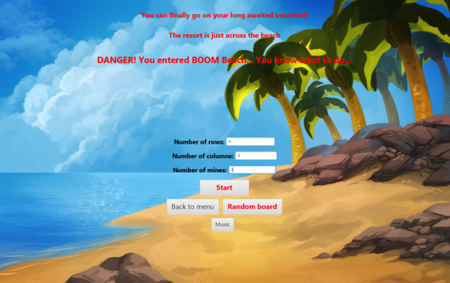

# MineSweeper-BoomBeach

#### General Info
One of my first fun projects for self improvement - trying new things using learned OOP concepts, Java language and getting more familiar with the use of SceneBuilder\JavaFX.

#### Technologies
* JAVA SE Platform 15 (JDK 15.0.1)
* JAVAFX SDK
* SceneBuilder 16.0
* Eclipse IDE

#### Setup
All necessary library files to run the project are included.

#### Example run
  

 
